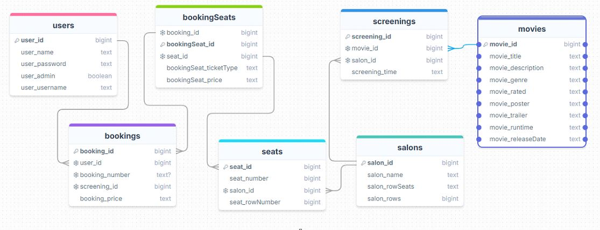

# 📽️ Filmvisarna

## 🧑‍💻 Team The Sicilian Squad

**Medlemmar:**

- Mathias
- Adrian
- Maricel
- Dalavan
- William

## 📁 Projektstruktur

```
├── Backend/                 # Node.js backend
│   ├── Config/             # Databasinställningar
│   ├── Controllers/        # API-controllers
│   ├── Middleware/         # Auth & admin middleware
│   ├── Models/             # Datamodeller
│   ├── Routes/             # API-routes
│   └── index.js            # Server entry point
│
└── Sicilian/               # React frontend
    └── src/                # Källkod
        ├── components/      # Återanvändbara komponenter
        ├── hooks/           # Custom React hooks
        ├── views/           # Sidvyer
        └── styling/         # CSS filer
```

## 🚀 Kom igång

### Förutsättningar

- Node.js (version 18 eller senare)
- npm (kommer med Node.js)

### Installation

1. Klona projektet:

```powershell
git clone [repository-url]
Set-Location
```

2. Installera backend-dependencies:

```powershell
Set-Location cd ./Backend
npm install
```

3. Installera frontend-dependencies:

```powershell
Set-Location cd ./Sicilian
npm install
```

### Starta applikationen

1. Starta backend-servern i ett nytt PowerShell-fönster:

```powershell
Set-Location cd ./Backend
node index.js
```

2. Öppna ett nytt PowerShell-fönster och starta frontend-utvecklingsservern:

```powershell
Set-Location cd ../Sicilian
npm run dev
```

Applikationen körs på `http://localhost:5173`

## 🔗 Länkar

- 📌 **Trello (Sprintplanering & Taskboard):** [[Länk till Trello](https://trello.com/invite/b/67ea89aa2aa09443b36993eb/ATTIf7328e5e04ce09c56d91afa5fe24c3a601CABB8A/agile-board-template-trello)]
- ⏱️ **Tidsrapport:** [[Länk till tidsrapport](https://docs.google.com/spreadsheets/d/1OtIt4UGSKhrz9V-15fxl6OU8sw0idddjvNq8PTeXKyI/edit?usp=sharing)]
- 🎨 **Figma** [[Länk till Figma](https://www.figma.com/proto/jUnsiRa3NOVTAF1yAdxb0R/Sicilian-Cinema-Project?node-id=0-1&t=sEFC9L27qtEGGbFS-1)]

## 📊 Databasdesign


